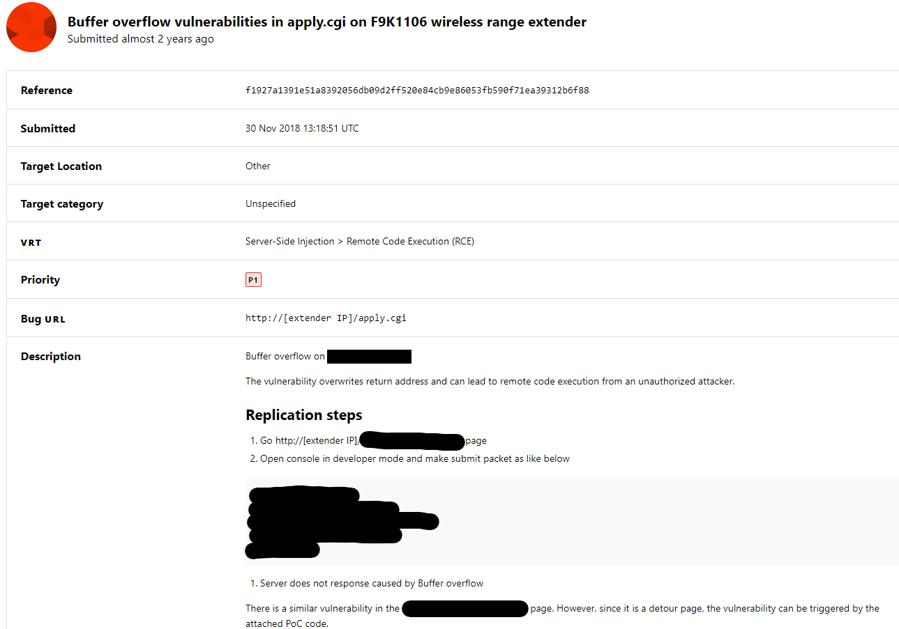

# Belkin Buffer Overflow vulnerability

**Exploit Author**: pr0v3rbs@kaist.ac.kr

**Vender**: Belkin

**Firmware version**:
F9K1106 - 1.00.16

**Hardware Link**:
https://www.belkin.com/us/support-product?pid=01t80000002xPq4AAE

## The detail of vulnerability ##

Progressing on the Bugcrowd

## Timeline

2018-11-30 : Report

2019-02-12 : Analyst fails to reproduce

2019-02-17 : Add more detail steps

2019-02-20 : Analyst fails to reproduce

2019-03-19 : Record video to prove the vulnerability

2019-03-20 : Confirmed (P1) and earned 40 points

2019-08-13 : Bugcrowd transfers information to Belkin International, Inc.
